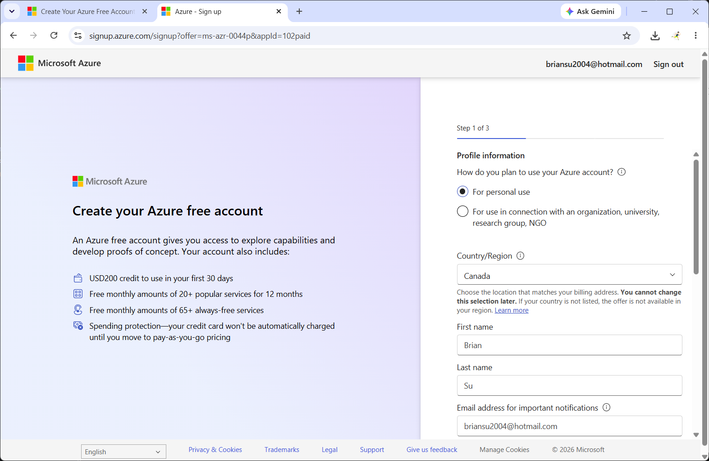
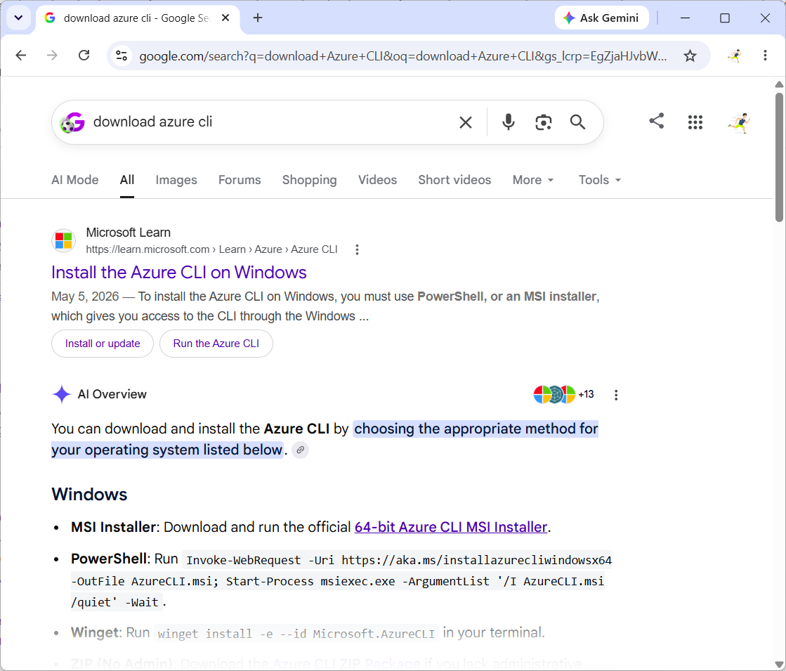
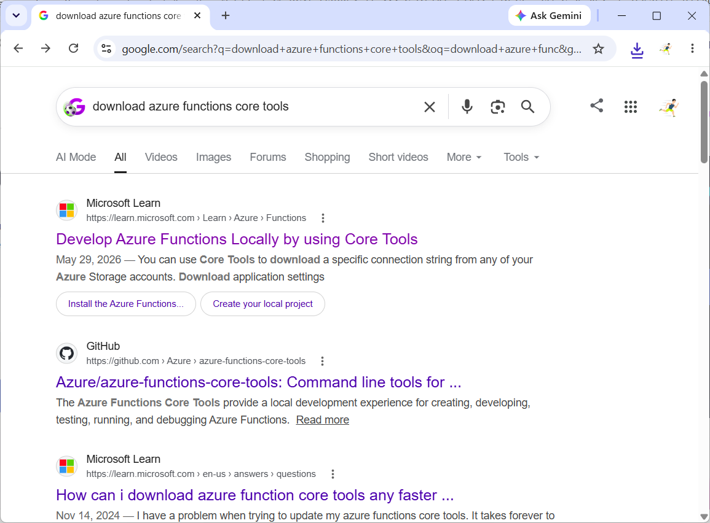
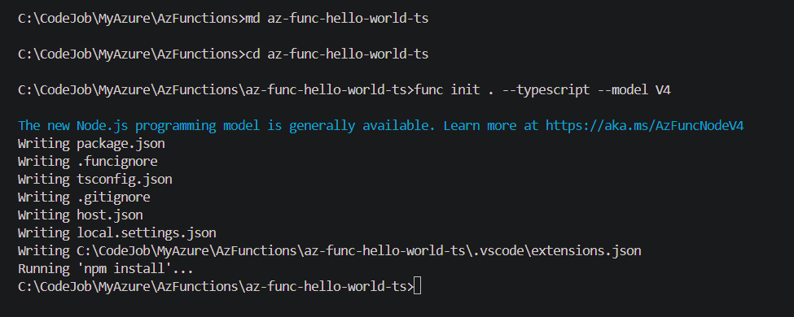
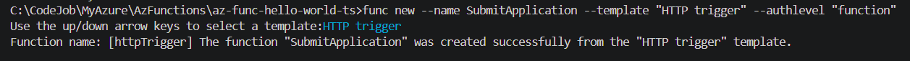
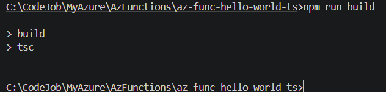
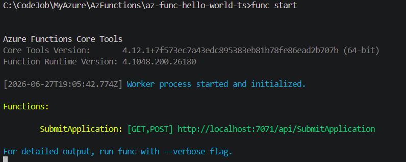
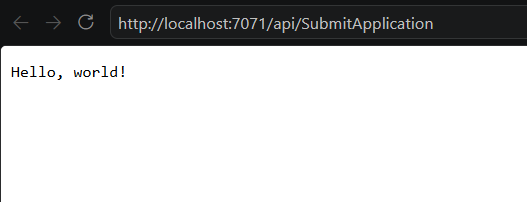
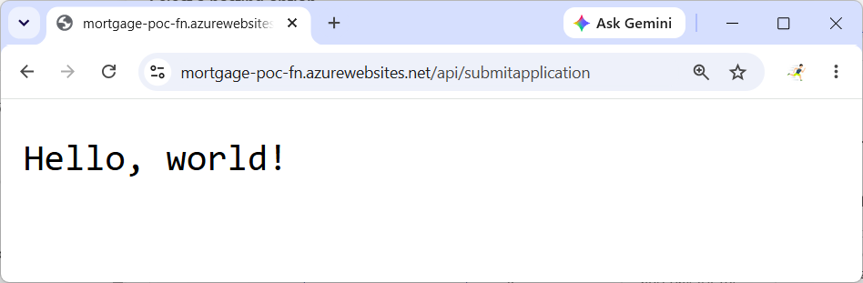

# Quickstart: Azure Functions (Windows 11 + Node.js + TypeScript)

- [**1. Prepare Your Azure Account**](#1-prepare-your-azure-account)
- [**2. Install Azure CLI**](#2-install-azure-cli)
- [**3. Install Azure Functions Core Tools**](#3-install-azure-functions-core-tools)
- [**4. Initialize a Function App Project**](#4-initialize-a-function-app-project)
- [**5. (Optional but Recommended) Create a Function Trigger**](#5-optional-but-recommended-create-a-function-trigger)
- [**6. Build**](#6-build)
- [**7. Start the Local Function Host**](#7-start-the-local-function-host)
- [**8. Test the Function Locally**](#8-test-the-function-locally)
- [**9. Publish to Azure**](#9-publish-to-azure)
- [**10. Test on Azure**](#10-test-on-azure)

<!-- The following are detailed one-by-one quickstart Azure Functioin steps.

Note: for demo purpose, use Windows 11 and NodeJS

## 1. Have Azure Account/Subscription

## 2. Install Azure CLI

- Download Azure CLI
- Install Azure CLI
- Az login

## 3. Install Azure Function Core Tools

- Download Azure Function Core Tools
- Install Azure Function Core Tools

## 4. Func init

## 5. Func start -->

## **1. Prepare Your Azure Account**

- Ensure you have an active Azure account and subscription.
- If you don't have one, create it at the Azure Portal.



- Note: for demo purpose, this quickstarts uses Windows 11 and NodeJS - download and install NodeJS if needed.

---

## **2. Install Azure CLI**

- Download Azure CLI from Microsoft's official site.
- Install Azure CLI on Windows 11.
- Sign in to Azure:

```dos
az login
```



---

## **3. Install Azure Functions Core Tools**

- Download Azure Functions Core Tools (version matching your Azure Functions runtime).
- Install the Core Tools.
- Verify installation:

```dos
func --version
```



---

## **4. Initialize a Function App Project**

Create a new Azure Functions project:

<!--
```dos
func init myfuncapp --javascript
```

Or for TypeScript:

```dos
func init myfuncapp --typescript
``` -->

```dos
md az-func-hello-world-ts
cd az-func-hello-world-ts
func init . --typescript --model V4
```



---

## **5. (Optional but Recommended) Create a Function Trigger**

Example: HTTP trigger

```dos
func new --name SubmitApplication --template "HTTP trigger" --authlevel "function"
```



---

## **6. Build**

```dos
npm run build
```



## **7. Start the Local Function Host**

Run the project locally:

```dos
func start
```

This launches the Azure Functions runtime on your machine and exposes local endpoints for testing.



---

## **8. Test the Function Locally**

Use browser or curl:

```dos
curl http://localhost:7071/api/SubmitApplication
```



---

## **9. Publish to Azure**

```dos
az group create --name rg-hello-ts --location canadacentral

az storage account create --name <unique-storage-name> --resource-group rg-hello-ts --location canadacentral --sku Standard_LRS

az provider register --namespace Microsoft.Web
az provider show --namespace Microsoft.Web --query "registrationState"
az provider list --query "[].{namespace:namespace, state:registrationState}" -o table


az functionapp create --resource-group rg-hello-ts --name <your-unique-function-app-name> --storage-account <unique-storage-name> --consumption-plan-location canadacentral --runtime node --runtime-version 24 --functions-version 4

func azure functionapp publish <your-unique-function-app-name> --typescript
```

<!-- <unique-storage-name> : mortgagepocstorage

<your-unique-function-app-name> : mortgage-poc-fn

Default Directory

az account list --output table

az login --tenant 2529c55c-ee56-40e9-9578-1d5d16b52bdf

az group create --name rg-hello-ts --location canadacentral

az storage account create --name mortgagepochello --resource-group rg-hello-ts --location canadacentral --sku Standard_LRS

az provider register --namespace Microsoft.Web
az provider show --namespace Microsoft.Web --query "registrationState"

az functionapp create --resource-group rg-hello-ts --name mortgage-poc-fn --storage-account mortgagepochello --consumption-plan-location canadacentral --runtime node --runtime-version 24 --functions-version 4

func azure functionapp publish mortgage-poc-fn --typescript
-->

Result

```dos
C:\CodeJob\MyAzure\AzFunctions\az-func-hello-world-ts>az group create --name rg-hello-ts --location canadacentral
{
  "id": "/subscriptions/85bf4aeb-7ac5-4dfb-bdca-47435d9ee5b0/resourceGroups/rg-hello-ts",
  "location": "canadacentral",
  "managedBy": null,
  "name": "rg-hello-ts",
  "properties": {
    "provisioningState": "Succeeded"
  },
  "tags": null,
  "type": "Microsoft.Resources/resourceGroups"
}

C:\CodeJob\MyAzure\AzFunctions\az-func-hello-world-ts>az storage account create --name mortgagepochello --resource-group rg-hello-ts --location canadacentral --sku Standard_LRS
{
  "accessTier": "Hot",
  "accountMigrationInProgress": null,
  "allowBlobPublicAccess": false,
  "allowCrossTenantReplication": false,
  "allowSharedKeyAccess": null,
  "allowSharedKeyAccessForServices": null,
  "allowedCopyScope": null,
  "azureFilesIdentityBasedAuthentication": null,
  "blobRestoreStatus": null,
  "creationTime": "2026-06-29T01:26:03.538096+00:00",
  "customDomain": null,
  "dataCollaborationPolicyProperties": null,
  "defaultToOAuthAuthentication": null,
  "dnsEndpointType": null,
  "dualStackEndpointPreference": null,
  "enableExtendedGroups": null,
  "enableHttpsTrafficOnly": true,
  "enableNfsV3": null,
  "encryption": {
    "encryptionIdentity": null,
    "keySource": "Microsoft.Storage",
    "keyVaultProperties": null,
    "requireInfrastructureEncryption": null,
    "services": {
      "blob": {
        "enabled": true,
        "keyType": "Account",
        "lastEnabledTime": "2026-06-29T01:26:03.686281+00:00"
      },
      "file": {
        "enabled": true,
        "keyType": "Account",
        "lastEnabledTime": "2026-06-29T01:26:03.686281+00:00"
      },
      "queue": null,
      "table": null
    }
  },
  "extendedLocation": null,
  "failoverInProgress": null,
  "geoPriorityReplicationStatus": null,
  "geoReplicationStats": null,
  "id": "/subscriptions/85bf4aeb-7ac5-4dfb-bdca-47435d9ee5b0/resourceGroups/rg-hello-ts/providers/Microsoft.Storage/storageAccounts/mortgagepochello",
  "identity": null,
  "immutableStorageWithVersioning": null,
  "isHnsEnabled": null,
  "isLocalUserEnabled": null,
  "isSftpEnabled": null,
  "isSkuConversionBlocked": null,
  "keyCreationTime": {
    "key1": "2026-06-29T01:26:03.676012+00:00",
    "key2": "2026-06-29T01:26:03.676012+00:00"
  },
  "keyPolicy": null,
  "kind": "StorageV2",
  "largeFileSharesState": null,
  "lastGeoFailoverTime": null,
  "location": "canadacentral",
  "minimumTlsVersion": "TLS1_0",
  "name": "mortgagepochello",
  "networkRuleSet": {
    "bypass": "AzureServices",
    "defaultAction": "Allow",
    "ipRules": [],
    "ipv6Rules": [],
    "resourceAccessRules": null,
    "virtualNetworkRules": []
  },
  "placement": null,
  "primaryEndpoints": {
    "blob": "https://mortgagepochello.blob.core.windows.net/",
    "dfs": "https://mortgagepochello.dfs.core.windows.net/",
    "file": "https://mortgagepochello.file.core.windows.net/",
    "internetEndpoints": null,
    "ipv6Endpoints": null,
    "microsoftEndpoints": null,
    "queue": "https://mortgagepochello.queue.core.windows.net/",
    "table": "https://mortgagepochello.table.core.windows.net/",
    "web": "https://mortgagepochello.z9.web.core.windows.net/"
  },
  "primaryLocation": "canadacentral",
  "privateEndpointConnections": [],
  "provisioningState": "Succeeded",
  "publicNetworkAccess": null,
  "resourceGroup": "rg-hello-ts",
  "routingPreference": null,
  "sasPolicy": null,
  "secondaryEndpoints": null,
  "secondaryLocation": null,
  "sku": {
    "name": "Standard_LRS",
    "tier": "Standard"
  },
  "statusOfPrimary": "available",
  "statusOfSecondary": null,
  "storageAccountSkuConversionStatus": null,
  "systemData": null,
  "tags": {},
  "type": "Microsoft.Storage/storageAccounts",
  "zones": null
}

C:\CodeJob\MyAzure\AzFunctions\az-func-hello-world-ts>az provider show --namespace Microsoft.Web --query "registrationState"
"Registered"

C:\CodeJob\MyAzure\AzFunctions\az-func-hello-world-ts>az functionapp create --resource-group rg-hello-ts --name mortgage-poc-fn --storage-account mortgagepochello --consumption-plan-location canadacentral --runtime node --runtime-version 24 --functions-version 4
Resource provider 'Microsoft.OperationalInsights' used by this operation is not registered. We are registering for you.
Registration succeeded.
Resource provider 'microsoft.insights' used by this operation is not registered. We are registering for you.
Registration succeeded.
Application Insights "mortgage-poc-fn" was created for this Function App. You can visit https://portal.azure.com/#resource/subscriptions/85bf4aeb-7ac5-4dfb-bdca-47435d9ee5b0/resourceGroups/rg-hello-ts/providers/microsoft.insights/components/mortgage-poc-fn/overview to view your Application Insights component
{
  "autoGeneratedDomainNameLabelScope": null,
  "availabilityState": "Normal",
  "clientAffinityEnabled": false,
  "clientAffinityPartitioningEnabled": null,
  "clientAffinityProxyEnabled": false,
  "clientCertEnabled": false,
  "clientCertExclusionPaths": null,
  "clientCertMode": "Required",
  "cloningInfo": null,
  "containerSize": 1536,
  "customDomainVerificationId": "D4F29F17D4CDA0AC5920157FDB15DB5BD3F2E8BC43284CDE0E05FEE771A48D6E",
  "dailyMemoryTimeQuota": 0,
  "daprConfig": null,
  "defaultHostName": "mortgage-poc-fn.azurewebsites.net",
  "dnsConfiguration": {
    "dnsAltServer": null,
    "dnsLegacySortOrder": null,
    "dnsMaxCacheTimeout": null,
    "dnsRetryAttemptCount": null,
    "dnsRetryAttemptTimeout": null,
    "dnsServers": null
  },
  "enabled": true,
  "enabledHostNames": [
    "mortgage-poc-fn.azurewebsites.net",
    "mortgage-poc-fn.scm.azurewebsites.net"
  ],
  "endToEndEncryptionEnabled": false,
  "extendedLocation": null,
  "functionAppConfig": null,
  "hostNameSslStates": [
    {
      "hostType": "Standard",
      "name": "mortgage-poc-fn.azurewebsites.net",
      "sslState": "Disabled",
      "thumbprint": null,
      "toUpdate": null,
      "virtualIp": null
    },
    {
      "hostType": "Repository",
      "name": "mortgage-poc-fn.scm.azurewebsites.net",
      "sslState": "Disabled",
      "thumbprint": null,
      "toUpdate": null,
      "virtualIp": null
    }
  ],
  "hostNames": [
    "mortgage-poc-fn.azurewebsites.net"
  ],
  "hostNamesDisabled": false,
  "hostingEnvironmentProfile": null,
  "httpsOnly": false,
  "hyperV": false,
  "id": "/subscriptions/85bf4aeb-7ac5-4dfb-bdca-47435d9ee5b0/resourceGroups/rg-hello-ts/providers/Microsoft.Web/sites/mortgage-poc-fn",
  "identity": null,
  "inProgressOperationId": null,
  "ipMode": "IPv4",
  "isDefaultContainer": null,
  "isXenon": false,
  "keyVaultReferenceIdentity": "SystemAssigned",
  "kind": "functionapp",
  "lastModifiedTimeUtc": "2026-06-29T01:35:12.250000",
  "location": "canadacentral",
  "managedEnvironmentId": null,
  "maxNumberOfWorkers": null,
  "name": "mortgage-poc-fn",
  "outboundIpAddresses": "130.107.216.50,130.107.16.247,130.107.160.250,4.174.224.52,4.174.192.55,52.237.51.30,130.107.18.65,130.107.18.139,130.107.216.157,4.174.210.91,40.82.186.88,130.107.18.142,4.174.228.159,130.107.220.54,4.174.228.201,52.228.113.200,20.175.151.148,20.220.131.121,130.107.21.216,20.48.130.49,130.107.42.100,20.116.204.179,20.116.170.89,20.48.138.96,130.107.209.24,4.174.225.14,130.107.25.231,4.174.197.22,130.107.25.155,130.107.225.127,20.116.42.0",
  "outboundVnetRouting": {
    "allTraffic": false,
    "applicationTraffic": false,
    "backupRestoreTraffic": false,
    "contentShareTraffic": false,
    "imagePullTraffic": false
  },
  "possibleOutboundIpAddresses": "130.107.216.50,130.107.16.247,130.107.160.250,4.174.224.52,4.174.192.55,52.237.51.30,130.107.18.65,130.107.18.139,130.107.216.157,4.174.210.91,40.82.186.88,130.107.18.142,4.174.228.159,130.107.220.54,4.174.228.201,52.228.113.200,20.175.151.148,20.220.131.121,130.107.21.216,20.48.130.49,130.107.42.100,20.116.204.179,20.116.170.89,20.48.138.96,130.107.209.24,4.174.225.14,130.107.25.231,4.174.197.22,130.107.25.155,130.107.225.127,130.107.163.68,130.107.224.155,130.107.181.169,40.82.185.199,130.107.24.239,130.107.161.30,130.107.185.18,20.48.170.43,130.107.224.242,130.107.169.173,130.107.200.17,40.82.186.44,130.107.224.44,130.107.185.61,4.174.192.212,130.107.170.10,130.107.181.238,52.237.48.195,130.107.17.45,130.107.40.222,4.174.210.147,4.174.225.141,130.107.226.162,4.174.198.55,4.174.225.166,20.116.42.0",
  "publicNetworkAccess": "Enabled",
  "redundancyMode": "None",
  "repositorySiteName": "mortgage-poc-fn",
  "reserved": false,
  "resourceConfig": null,
  "resourceGroup": "rg-hello-ts",
  "scmSiteAlsoStopped": false,
  "serverFarmId": "/subscriptions/85bf4aeb-7ac5-4dfb-bdca-47435d9ee5b0/resourceGroups/rg-hello-ts/providers/Microsoft.Web/serverfarms/CanadaCentralPlan",
  "siteConfig": {
    "acrUseManagedIdentityCreds": false,
    "acrUserManagedIdentityId": null,
    "alwaysOn": false,
    "apiDefinition": null,
    "apiManagementConfig": null,
    "appCommandLine": null,
    "appSettings": null,
    "autoHealEnabled": null,
    "autoHealRules": null,
    "autoSwapSlotName": null,
    "azureStorageAccounts": null,
    "connectionStrings": null,
    "cors": null,
    "defaultDocuments": null,
    "detailedErrorLoggingEnabled": null,
    "documentRoot": null,
    "elasticWebAppScaleLimit": null,
    "experiments": null,
    "ftpsState": null,
    "functionAppScaleLimit": 0,
    "functionsRuntimeScaleMonitoringEnabled": null,
    "handlerMappings": null,
    "healthCheckPath": null,
    "http20Enabled": false,
    "http20ProxyFlag": null,
    "httpLoggingEnabled": null,
    "ipSecurityRestrictions": [
      {
        "action": "Allow",
        "description": "Allow all access",
        "headers": null,
        "ipAddress": "Any",
        "name": "Allow all",
        "priority": 2147483647,
        "subnetMask": null,
        "subnetTrafficTag": null,
        "tag": null,
        "vnetSubnetResourceId": null,
        "vnetTrafficTag": null
      }
    ],
    "ipSecurityRestrictionsDefaultAction": null,
    "javaContainer": null,
    "javaContainerVersion": null,
    "javaVersion": null,
    "keyVaultReferenceIdentity": null,
    "limits": null,
    "linuxFxVersion": "",
    "loadBalancing": null,
    "localMySqlEnabled": null,
    "logsDirectorySizeLimit": null,
    "machineKey": null,
    "managedPipelineMode": null,
    "managedServiceIdentityId": null,
    "metadata": null,
    "minTlsCipherSuite": null,
    "minTlsVersion": null,
    "minimumElasticInstanceCount": 0,
    "netFrameworkVersion": null,
    "nodeVersion": null,
    "numberOfWorkers": 1,
    "phpVersion": null,
    "powerShellVersion": null,
    "preWarmedInstanceCount": null,
    "publicNetworkAccess": null,
    "publishingUsername": null,
    "push": null,
    "pythonVersion": null,
    "remoteDebuggingEnabled": null,
    "remoteDebuggingVersion": null,
    "requestTracingEnabled": null,
    "requestTracingExpirationTime": null,
    "scmIpSecurityRestrictions": [
      {
        "action": "Allow",
        "description": "Allow all access",
        "headers": null,
        "ipAddress": "Any",
        "name": "Allow all",
        "priority": 2147483647,
        "subnetMask": null,
        "subnetTrafficTag": null,
        "tag": null,
        "vnetSubnetResourceId": null,
        "vnetTrafficTag": null
      }
    ],
    "scmIpSecurityRestrictionsDefaultAction": null,
    "scmIpSecurityRestrictionsUseMain": null,
    "scmMinTlsVersion": null,
    "scmType": null,
    "tracingOptions": null,
    "use32BitWorkerProcess": null,
    "virtualApplications": null,
    "vnetName": null,
    "vnetPrivatePortsCount": null,
    "vnetRouteAllEnabled": null,
    "webSocketsEnabled": null,
    "websiteTimeZone": null,
    "windowsFxVersion": null,
    "xManagedServiceIdentityId": null
  },
  "sku": "Dynamic",
  "slotSwapStatus": null,
  "sshEnabled": null,
  "state": "Running",
  "storageAccountRequired": false,
  "suspendedTill": null,
  "systemData": null,
  "tags": null,
  "targetSwapSlot": null,
  "trafficManagerHostNames": null,
  "type": "Microsoft.Web/sites",
  "usageState": "Normal",
  "virtualNetworkSubnetId": null,
  "workloadProfileName": null
}

C:\CodeJob\MyAzure\AzFunctions\az-func-hello-world-ts>func azure functionapp publish mortgage-poc-fn --typescript
Getting site publishing info...
[2026-06-29T01:44:44.035Z] Starting the function app deployment...
Creating archive for current directory...
Uploading 1.32 MB [###############################################################################]
Upload completed successfully.
Deployment completed successfully.
[2026-06-29T01:45:21.283Z] Syncing triggers...
Functions in mortgage-poc-fn:
    SubmitApplication - [httpTrigger]
        Invoke url: https://mortgage-poc-fn.azurewebsites.net/api/submitapplication
```

---

## **10. Test on Azure**

https://<your-unique-function-app-name>.azurewebsites.net/api/SubmitApplication?name=Brian


