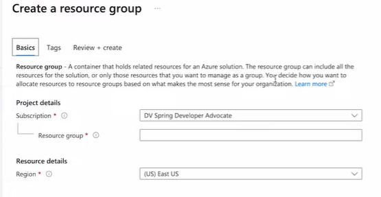
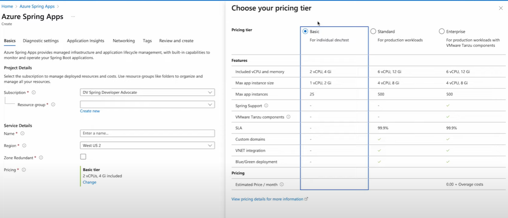
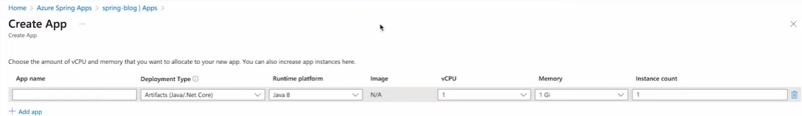
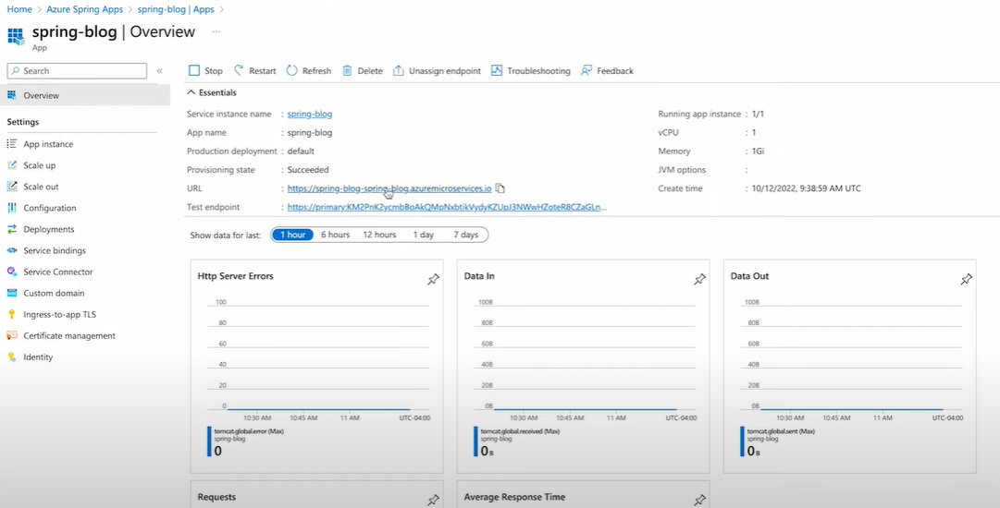

# How to deploy a Spring Boot app to Azure

## Prerequsites

### Create a resource group



In the resource group:

- Database
- App
- ...

### Create an "Azure Spring App"

Azure Spring Apps is a fully managed service for Spring developers. Manage the lifecycle of your Spring Boot applications with comprehensive monitoring and diagnostics, configuration management, service discovery, CI/CD integration, and blue-green deployments.

[Ship faster with Enterprise tier and VMware Tanzu]

Securely deploy, operate, and scale enterprise Spring Boot applications on Azure. Azure Spring Apps Enterprise offers commercial VMware Tanzu components built to address enterprise requirements around configuration management, integration, portability, flexibility, and support. Use commercial versions of Tanzu Build Service, Application Configuration, Service Registry, and more, all backed by support from VMware and Microsoft.

Tanzu Build Service

[Azure Spring Apps pricing]

Azure Spring Apps offers three pricing tiers: Basic, Standard, and Enterprise.

- The Basic tier targets dev/test and trials.
- The Standard tier is optimized for running general-purpose production traffic.
- The Enterprise tier provides on-demand VMware Tanzu components and commercial Spring Runtime support.





Configuration

Deployments (Blue-green)

...

### Create the artifact

A jar file!

#### Method 1: manual pipeline with Azure CLI and Maven plugin etc. (not recommended)

Quickstart: Deploy your first application to Azure Spring Apps

<https://learn.microsoft.com/en-us/azure/spring-apps/quickstart?tabs=Azure-CLI>

#### Method 2: automate pipeline with GitHub actions or similar tools (recommended)

GitHub secrets

```yml
name: AzureSpringCloud
on: push
env:
  ASC_PACKAGE_PATH: ${{ github.workspace }}
  JAVA_VERSION: 17
  AZURE_SUBSCRIPTION: c70085e6-c3ce-4d50-b40c-d03cb762d680

jobs:
  deploy_to_production:
    runs-on: ubuntu-latest
    name: deploy to production with artifact
    steps:
      - name: Checkout Github Action
        uses: actions/checkout@v2
        
      - name: Set up JDK ${{ env.JAVA_VERSION }}
        uses: actions/setup-java@v1
        with:
          java-version: ${{ env.JAVA_VERSION }}

      - name: maven build, clean
        run: |
          mvn clean package -DskipTests
      - name: Login via Azure CLI
        uses: azure/login@v1
        with:
          creds: ${{ secrets.AZURE_CREDENTIALS }}

      - name: deploy to production with artifact
        uses: azure/spring-cloud-deploy@v1
        with:
          azure-subscription: ${{ env.AZURE_SUBSCRIPTION }}
          action: Deploy
          service-name: spring-blog
          app-name: spring-blog
          use-staging-deployment: false
          package: ${{ env.ASC_PACKAGE_PATH }}/**/*.jar
```

### Post-deployment verifications

URL

Test endpoint


